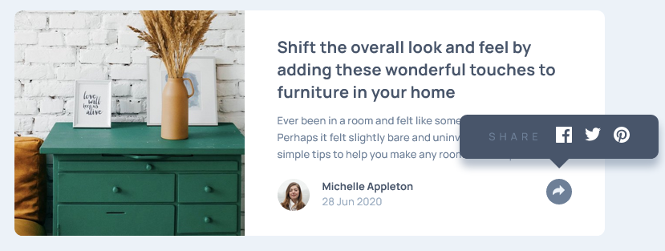
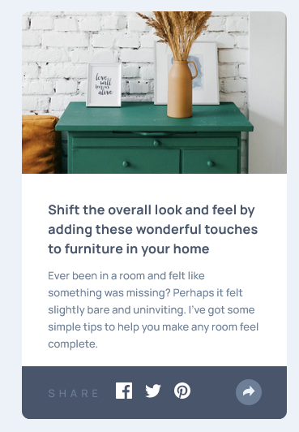

# Frontend Mentor - Article preview component solution

### The challenge
The goal is to create an article preview component while making it look as close to the original design as possible using HTML, CSS and JavaScript.

Users should be able to:

- View the optimal layout for the component depending on their device's screen size
- See the social media share links when they click the share icon

### Screenshot

### Links

- Solution URL: [Add solution URL here](https://your-solution-url.com)
- Live Site URL: [https://aleksaus.github.io/Article-preview-component/](https://your-live-site-url.com)

## My process

### Built with

- Semantic HTML5 markup
- Flexbox
- CSS Grid
- JavaScript

## Author

- Website - [Aleksandar Tadic](https://github.com/AleksAus/)
- Frontend Mentor - [@AleksAus](https://www.frontendmentor.io/profile/AleksAus)
